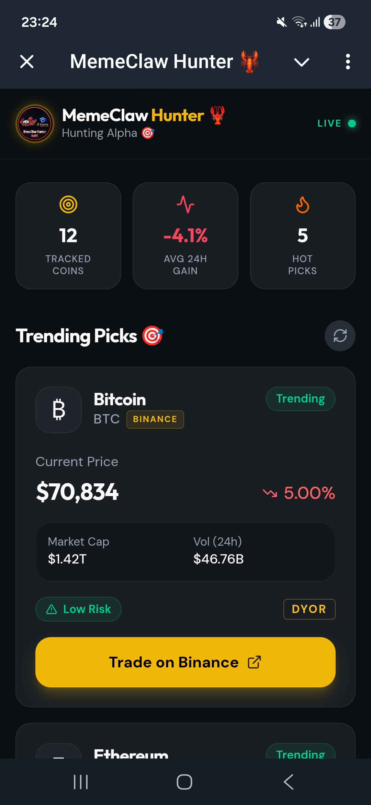

# MemeClaw Hunter🦞 - AI Alpha Scout

**MemeClaw Hunter** is a next-generation AI assistant built for the Binance ecosystem. It doesn't just watch the market; it hunts for Alpha. Powered by **OpenClaw** and **Kimi-k2.5 Pro**, it delivers institutional-grade analysis directly to your favorite social platforms.

---

## 🚀 Key Features
- **Smart Money Tracking:** Real-time monitoring of whale inflows and high-risk launches.
- **Strategic Snapshots:** Automated technical analysis including Entry Thoughts, Support/Resistance, and DCA strategies.
- **Omni-channel Delivery:** Seamlessly integrated across **WhatsApp, Discord, and Telegram**.
- **Interactive Mini-App:** A dedicated dashboard hosted on **Replit** for visual data tracking.

## 🧠 Tech Stack & High-Availability Architecture
To deliver a production-ready experience, **MemeClaw Hunter** is built on a multi-layered cloud architecture designed for 24/7 reliability:

- **AI Intelligence Engine:** Powered by **OpenClaw**, utilizing a hybrid model of **Kimi 2.5** (for deep-dive research) and **Gemini 3.1 Pro** (for advanced market logic and Binance Skill integration).
- **Core Hosting & Logic:** - **Replit:** Servers as the primary cloud host for the assistant's brain and API handling.
  - **Cron-job.org (The Heartbeat):** Integrated as a professional external scheduler to bypass cloud sleep cycles. This ensures **zero-latency** market polling and 100% uptime for Alpha delivery to Binance users.
- **Frontend UI:** A custom-built **Telegram & Discord Mini-App** interface (HTML/JS) for high-performance visual data tracking (Source code included in this repo).
- **Social Ecosystem Integration:** - **Binance Square:** Features an **Automated Publishing System** to share real-time Alpha insights. 
  - *Note: This exclusive feature is optimized for Binance users to enhance community engagement and requires a verified Binance account for full interaction.*
  
## 📊 Sample Output (Deep-Dive Analysis)
> *The system generates institutional-grade market snapshots as seen in our community reports.*

- **Strategic Technical Analysis:** Detailed price action review with Entry/Exit zones.
- **Dynamic Risk Score:** Real-time auditing for high-risk assets and whale movement.
- **Fail-safe Mechanism:** Frontend ensures data persistence even during API sync intervals.
- 

*MemeClaw Hunter: Bridging AI Intelligence with Binance Execution for the next generation of Alpha seekers.*

## 🛠️ Technical Deep Dive (Source Code)
The project logic is divided into specialized modules for maximum efficiency:

* **[Alpha Scout](binance_alpha_scout.py)**: The core Python engine for real-time meme coin detection.
* **[Binance Hub Connector](binance_hub_scout.py)**: Direct integration with Binance Skills Hub for market ranking.
* **[Cloud Bridge](replit_bridge.py)**: Facilitates the connection between OpenClaw logic and the Replit dashboard.

### 📜 Knowledge Base
Check out our internal documentation:
- [System Skills & Tools](TOOLS.md)
- [Agent Intelligence Logic](SOUL.md)
